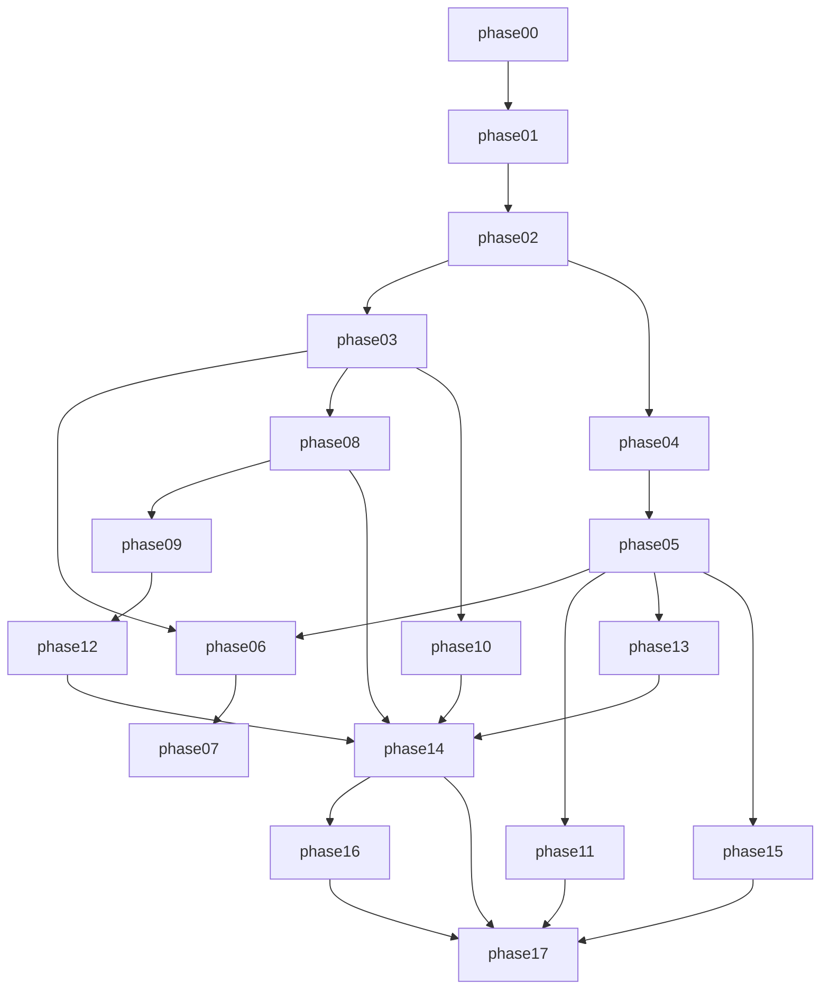

# Push Stars — мастер-план разработки

Документ-«единственная правда» для продукта и порядка внедрения. Детали по фазам — в [`docs/plan/`](docs/plan/). Архитектура Firebase и Ghost — в [`docs/architecture/`](docs/architecture/).

---

## 1. Что такое Push Stars

Мобильное приложение (киберспорт в реальном времени): **PvP-дуэли по калистенике**. Компьютерное зрение (**MediaPipe**, локально) считает повторения и оценивает технику. Между игроками **не передаётся видео** — только сжатые координаты скелета через **Photon PUN2**; оппонент отображается как **3D-аватар (Genies SDK)**. Победы и прогресс дают **XP**, **трофеи**, **ранг** и косметику аватара. MVP: **2 режима** (PvP + Ghost), **1 упражнение** (отжимания), **60 сек**.

---

## 2. Технологический стек (зафиксирован)

| Слой | Технология |
|------|------------|
| Клиент | **Unity** (2022 LTS), iOS + Android |
| CV | **MediaPipe** через Unity Plugin (Homuler / аналог) |
| Мультиплеер синхронизации матча | **Photon PUN2** |
| Аватар | **Genies SDK** |
| Backend | **Firebase**: Auth, Firestore, RTDB (очередь матчмейкинга), Storage (ghost binary), Functions, FCM, Crashlytics, Analytics |
| Deep links MVP | **Branch.io** или **AppsFlyer** (Firebase Dynamic Links недоступен для новых проектов с августа 2025) |
| Async UX-код | **UniTask** (рекомендация) |
| UI анимации | **DOTween** (рекомендация) |

План биллинга Firebase: **Blaze** (Functions + RTDB + webhook-провайдер).

---

## 3. Глоссарий

| Термин | Значение |
|--------|----------|
| **XP** | Опыт за качественные повторы; косметика / прогресс аватара |
| **Трофеи** | Число для лиги; ± за PvP (полный объём), ±половина за Ghost vs свой рекорд |
| **Ранг / лига** | Bronze → Silver → Gold → Diamond (пороги в constants.md) |
| **Стрик** | Текущая серия побед подряд |
| **Ghost Mode** | Дуэль против **собственной лучшей записи** (скелет в файле + сохранённые репы) |
| **Форма (FORM)** | Оценка техники из CV |
| **Темпо** | Скорость повторов (напр. /сек) |
| **Aura / монеты премиум** | Косметика (из дизайна); отложено после базовой экономики MVP |

---

## 4. Константы

Числовая правда: **[docs/architecture/constants.md](docs/architecture/constants.md)**  
Ghost-поток и матчи: **[docs/architecture/ghost-mode-spec.md](docs/architecture/ghost-mode-spec.md)**

Ключевые значения MVP:

- `MATCH_DURATION_SEC = 60`, `MAX_REPS_PER_MATCH = 65`
- PvP: `TROPHY_WIN = 25`, `TROPHY_LOSS = 15`
- Ghost: `TROPHY_GHOST_WIN = 12`, `TROPHY_GHOST_LOSS = 7`

---

## 5. Карта экранов (дизайн) → фазы

Ссылка на описание макетов: **[docs/design/screens-reference.md](docs/design/screens-reference.md)**

| Экран | Фазы |
|-------|------|
| Главная дуэль / таб VS | 02–03, 14 |
| Поиск соперника | 14 |
| Прематч VS + Ready | 14 |
| HUD дуэли | 08, 10, 14 |
| Результат дуэли / награды | 05, 14 |
| Лига | 11 |
| Профиль + статистика | 06 |
| Настройки | 07 |
| Калибровка камеры / качество трекинга | 08, 09, 14 |
| Обучение форме | 09 |

---

## 6. Индекс фаз

| ID | Файл | Кратко |
|----|------|--------|
| 00 | [phase-00-repo-and-docs.md](docs/plan/phase-00-repo-and-docs.md) | Репозиторий, .gitignore, документы |
| 01 | [phase-01-external-services.md](docs/plan/phase-01-external-services.md) | Firebase, Photon, Apple/Google |
| 02 | [phase-02-unity-skeleton.md](docs/plan/phase-02-unity-skeleton.md) | Пустой Unity-проект, 3 таба |
| 03 | [phase-03-design-system.md](docs/plan/phase-03-design-system.md) | Токены, префабы UI |
| 04 | [phase-04-firebase-sdk.md](docs/plan/phase-04-firebase-sdk.md) | Firebase в клиенте |
| 05 | [phase-05-backend-core.md](docs/plan/phase-05-backend-core.md) | Functions-база, правила, без PvP webhook |
| 06 | [phase-06-profile-screen.md](docs/plan/phase-06-profile-screen.md) | Профиль, история матчей |
| 07 | [phase-07-settings-screen.md](docs/plan/phase-07-settings-screen.md) | Настройки, GDPR |
| 08 | [phase-08-mediapipe-rep-counter.md](docs/plan/phase-08-mediapipe-rep-counter.md) | CV, репы, калибровка |
| 09 | [phase-09-training-and-onboarding.md](docs/plan/phase-09-training-and-onboarding.md) | Тренировка, эталон, офлайн XP |
| 10 | [phase-10-genies-avatar-wardrobe.md](docs/plan/phase-10-genies-avatar-wardrobe.md) | Genies, гардероб |
| 11 | [phase-11-league-leaderboard.md](docs/plan/phase-11-league-leaderboard.md) | Лига, сезон, кеш |
| 12 | [phase-12-ghost-mode.md](docs/plan/phase-12-ghost-mode.md) | Запись best, Ghost матч |
| 13 | [phase-13-photon-server-side.md](docs/plan/phase-13-photon-server-side.md) | Matchmaking CF, webhook |
| 14 | [phase-14-pvp-client-and-ux.md](docs/plan/phase-14-pvp-client-and-ux.md) | Клиент PvP end-to-end |
| 15 | [phase-15-fcm-and-retention.md](docs/plan/phase-15-fcm-and-retention.md) | Push FCM + APNs |
| 16 | [phase-16-friend-invites-deeplinks.md](docs/plan/phase-16-friend-invites-deeplinks.md) | Инвайты, Branch |
| 17 | [phase-17-polish-and-store.md](docs/plan/phase-17-polish-and-store.md) | Стор, локализация, метрики |

---

## 7. Граф зависимостей фаз

Параллельно после **03**: можно вести **08** и **10** разными людьми; **11** после **05** не блокируется CV.

---

## 8. Правила работы для новых чатов с агентом

1. Прикрепить **`PROJECT_PLAN.md`** + **`docs/plan/phase-XX-....md`** для нужной фазы.
2. Если затронуты деньги/античит/данные — добавить **`docs/architecture/firebase-architecture-v2.md`** и при Ghost — **`ghost-mode-spec.md`**.
3. Шаблон запроса:
   > Прочитай `PROJECT_PLAN.md` и `docs/plan/phase-XX-....md`. Реализуй только эту фазу. Не делай пункты из раздела «Что НЕ делаем». После работы обнови чеклист в файле фазы и список файлов.

4. Одна фаза = один осмысленный PR / серия коммитов без смешивания следующей фазы.

---

## 9. Конвенции кода (Unity / C#)

- Корневой namespace: `PushStars.*` (например `PushStars.UI`, `PushStars.Gameplay`, `PushStars.Networking`).
- Асинхронность UI и Firebase: **UniTask**, избегать `async void` кроме точечных подписчиков.
- Архитектура экранов: **MVP** или **MVVM** — выбрать один в фазе 02 и не смешивать.
- Сборки: Assembly Definitions по слоям (`PushStars.Core`, `PushStars.Firebase`, …).
- Сцены: префиксы `Boot_`, `Main_`, `Fight_`, `Training_` (уточнить в фазе 02).

---

## 10. Риски и открытые вопросы

| Риск | Митигация |
|------|-----------|
| Лицензия / доступность Genies SDK в Store | Проверить ToS и наличие пакета под ваши bundle ID до фазы 10 |
| MediaPipe FPS на слабых Android | Профилировать в фазе 08; падение до 15–20 FPS с интерполяцией |
| Photon free CCU | Мониторинг; лимит 20 CCU на старте |
| Античит Ghost callable | MVP: лимит репов + идемпотентность; позже — серверная проверка файла |
| Dynamic Links | Использовать Branch/AppsFlyer (фаза 16) |

---

## 11. Связанные документы

- [README.md](README.md)
- [docs/architecture/firebase-architecture-v2.md](docs/architecture/firebase-architecture-v2.md)
- [docs/architecture/ghost-mode-spec.md](docs/architecture/ghost-mode-spec.md)
- [docs/architecture/constants.md](docs/architecture/constants.md)
- [docs/design/screens-reference.md](docs/design/screens-reference.md)
